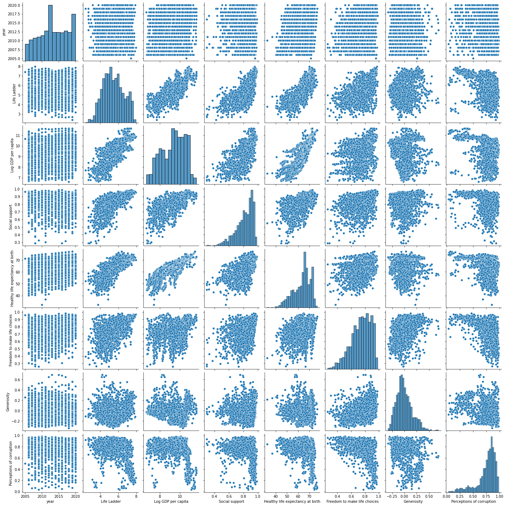

# Projeto World Happiness Report 
Douglas Yuki Kawakame

## Estudo de Caso

Vamos começar destrinchando de vez o clássico dataset sobre o _world-happiness-report-2021_!
<br><br>
O primeiro passo seria conhecer o dataset e saber mais sobre as informações disponíveis nele. Esse dataset foi obtido através do [Kaggle](https://www.kaggle.com/).


```python
import pandas as pd
import numpy as np
import matplotlib.pyplot as plt
import seaborn as sns
```


```python
happy = pd.read_csv('C:/Users/douglas.kawakame/Desktop/Lets_Code/Data_Science/world-happiness-report.csv')
happy.sample(5)
```


<div>
<style scoped>
    .dataframe tbody tr th:only-of-type {
        vertical-align: middle;
    }

    .dataframe tbody tr th {
        vertical-align: top;
    }

    .dataframe thead th {
        text-align: right;
    }
</style>
<table border="1" class="dataframe">
  <thead>
    <tr style="text-align: right;">
      <th></th>
      <th>Country name</th>
      <th>year</th>
      <th>Life Ladder</th>
      <th>Log GDP per capita</th>
      <th>Social support</th>
      <th>Healthy life expectancy at birth</th>
      <th>Freedom to make life choices</th>
      <th>Generosity</th>
      <th>Perceptions of corruption</th>
      <th>Positive affect</th>
      <th>Negative affect</th>
    </tr>
  </thead>
  <tbody>
    <tr>
      <th>147</th>
      <td>Belgium</td>
      <td>2005</td>
      <td>7.262</td>
      <td>10.745</td>
      <td>0.935</td>
      <td>69.90</td>
      <td>0.924</td>
      <td>NaN</td>
      <td>0.598</td>
      <td>0.796</td>
      <td>0.260</td>
    </tr>
    <tr>
      <th>683</th>
      <td>Haiti</td>
      <td>2017</td>
      <td>3.824</td>
      <td>7.475</td>
      <td>0.647</td>
      <td>55.50</td>
      <td>0.484</td>
      <td>0.381</td>
      <td>0.647</td>
      <td>0.573</td>
      <td>0.322</td>
    </tr>
    <tr>
      <th>548</th>
      <td>Ethiopia</td>
      <td>2018</td>
      <td>4.379</td>
      <td>7.651</td>
      <td>0.740</td>
      <td>58.50</td>
      <td>0.740</td>
      <td>0.039</td>
      <td>0.799</td>
      <td>0.660</td>
      <td>0.272</td>
    </tr>
    <tr>
      <th>135</th>
      <td>Belarus</td>
      <td>2008</td>
      <td>5.463</td>
      <td>9.677</td>
      <td>0.904</td>
      <td>61.70</td>
      <td>0.640</td>
      <td>-0.220</td>
      <td>0.696</td>
      <td>NaN</td>
      <td>0.246</td>
    </tr>
    <tr>
      <th>39</th>
      <td>Argentina</td>
      <td>2008</td>
      <td>5.961</td>
      <td>10.048</td>
      <td>0.892</td>
      <td>67.06</td>
      <td>0.678</td>
      <td>-0.132</td>
      <td>0.865</td>
      <td>0.823</td>
      <td>0.318</td>
    </tr>
  </tbody>
</table>
</div>


De acordo com a documentação do [world-happiness-report](https://www.kaggle.com/ajaypalsinghlo/world-happiness-report-2021) no Kaggle, a pesquisa sobre o nível de felicidade e como cada um dos seis fatores - produção econômica, suporte social, expectativa de vida, liberdade, percepção de corrupção e generosidade - contribui para tornar as avaliações de vida mais altas em cada país ao longo dos anos.

A Definição de cada variável pode ser encontrada [aqui](https://happiness-report.s3.amazonaws.com/2021/Appendix1WHR2021C2.pdf).


```python
happy.info()
```

    <class 'pandas.core.frame.DataFrame'>
    RangeIndex: 1949 entries, 0 to 1948
    Data columns (total 11 columns):
     #   Column                            Non-Null Count  Dtype  
    ---  ------                            --------------  -----  
     0   Country name                      1949 non-null   object 
     1   year                              1949 non-null   int64  
     2   Life Ladder                       1949 non-null   float64
     3   Log GDP per capita                1913 non-null   float64
     4   Social support                    1936 non-null   float64
     5   Healthy life expectancy at birth  1894 non-null   float64
     6   Freedom to make life choices      1917 non-null   float64
     7   Generosity                        1860 non-null   float64
     8   Perceptions of corruption         1839 non-null   float64
     9   Positive affect                   1927 non-null   float64
     10  Negative affect                   1933 non-null   float64
    dtypes: float64(9), int64(1), object(1)
    memory usage: 167.6+ KB
    

### Dados Errôneos / Dados Faltantes

Vamos verificar a consistência dos dados:


```python
for var in happy:
    # imprime variavel e seu tipo
    print(var,":", happy[var].dtype.name, end="")
    # se nao numérico
    if not np.issubdtype(happy[var].dtype, np.number):
        print("\n\t",happy[var].nunique(), "distintos: ", end="")
        print(happy[var].unique())
    else:
        print(", intervalo: ",end="")
        print(happy[var].min(), ",", happy[var].max())
```

    Country name : object
    	 166 distintos: ['Afghanistan' 'Albania' 'Algeria' 'Angola' 'Argentina' 'Armenia'
     'Australia' 'Austria' 'Azerbaijan' 'Bahrain' 'Bangladesh' 'Belarus'
     'Belgium' 'Belize' 'Benin' 'Bhutan' 'Bolivia' 'Bosnia and Herzegovina'
     'Botswana' 'Brazil' 'Bulgaria' 'Burkina Faso' 'Burundi' 'Cambodia'
     'Cameroon' 'Canada' 'Central African Republic' 'Chad' 'Chile' 'China'
     'Colombia' 'Comoros' 'Congo (Brazzaville)' 'Congo (Kinshasa)'
     'Costa Rica' 'Croatia' 'Cuba' 'Cyprus' 'Czech Republic' 'Denmark'
     'Djibouti' 'Dominican Republic' 'Ecuador' 'Egypt' 'El Salvador' 'Estonia'
     'Ethiopia' 'Finland' 'France' 'Gabon' 'Gambia' 'Georgia' 'Germany'
     'Ghana' 'Greece' 'Guatemala' 'Guinea' 'Guyana' 'Haiti' 'Honduras'
     'Hong Kong S.A.R. of China' 'Hungary' 'Iceland' 'India' 'Indonesia'
     'Iran' 'Iraq' 'Ireland' 'Israel' 'Italy' 'Ivory Coast' 'Jamaica' 'Japan'
     'Jordan' 'Kazakhstan' 'Kenya' 'Kosovo' 'Kuwait' 'Kyrgyzstan' 'Laos'
     'Latvia' 'Lebanon' 'Lesotho' 'Liberia' 'Libya' 'Lithuania' 'Luxembourg'
     'Madagascar' 'Malawi' 'Malaysia' 'Maldives' 'Mali' 'Malta' 'Mauritania'
     'Mauritius' 'Mexico' 'Moldova' 'Mongolia' 'Montenegro' 'Morocco'
     'Mozambique' 'Myanmar' 'Namibia' 'Nepal' 'Netherlands' 'New Zealand'
     'Nicaragua' 'Niger' 'Nigeria' 'North Cyprus' 'North Macedonia' 'Norway'
     'Oman' 'Pakistan' 'Palestinian Territories' 'Panama' 'Paraguay' 'Peru'
     'Philippines' 'Poland' 'Portugal' 'Qatar' 'Romania' 'Russia' 'Rwanda'
     'Saudi Arabia' 'Senegal' 'Serbia' 'Sierra Leone' 'Singapore' 'Slovakia'
     'Slovenia' 'Somalia' 'Somaliland region' 'South Africa' 'South Korea'
     'South Sudan' 'Spain' 'Sri Lanka' 'Sudan' 'Suriname' 'Swaziland' 'Sweden'
     'Switzerland' 'Syria' 'Taiwan Province of China' 'Tajikistan' 'Tanzania'
     'Thailand' 'Togo' 'Trinidad and Tobago' 'Tunisia' 'Turkey' 'Turkmenistan'
     'Uganda' 'Ukraine' 'United Arab Emirates' 'United Kingdom'
     'United States' 'Uruguay' 'Uzbekistan' 'Venezuela' 'Vietnam' 'Yemen'
     'Zambia' 'Zimbabwe']
    year : int64, intervalo: 2005 , 2020
    Life Ladder : float64, intervalo: 2.375 , 8.019
    Log GDP per capita : float64, intervalo: 6.635 , 11.648
    Social support : float64, intervalo: 0.29 , 0.987
    Healthy life expectancy at birth : float64, intervalo: 32.3 , 77.1
    Freedom to make life choices : float64, intervalo: 0.258 , 0.985
    Generosity : float64, intervalo: -0.335 , 0.698
    Perceptions of corruption : float64, intervalo: 0.035 , 0.983
    Positive affect : float64, intervalo: 0.322 , 0.9440000000000001
    Negative affect : float64, intervalo: 0.083 , 0.705
    


```python
happy.isna().sum()
```


    Country name                          0
    year                                  0
    Life Ladder                           0
    Log GDP per capita                   36
    Social support                       13
    Healthy life expectancy at birth     55
    Freedom to make life choices         32
    Generosity                           89
    Perceptions of corruption           110
    Positive affect                      22
    Negative affect                      16
    dtype: int64


Como não temos macro grupos para alterar os dados faltantes por uma média que faça sentido, iremos dropar as linhas com valores faltantes.


```python
happy2 = happy.dropna()
```


```python
happy2.isna().sum()
```


    Country name                        0
    year                                0
    Life Ladder                         0
    Log GDP per capita                  0
    Social support                      0
    Healthy life expectancy at birth    0
    Freedom to make life choices        0
    Generosity                          0
    Perceptions of corruption           0
    Positive affect                     0
    Negative affect                     0
    dtype: int64


O tamanho final do dataset ficou da seguinte forma:


```python
happy2.shape
```


    (1708, 11)


### Redundância de Dados

Dentro dos pontos da redundância de Dados, vamos primeiramente verificar os valores duplicados:


```python
happy2[happy2.duplicated()]
```


<div>
<style scoped>
    .dataframe tbody tr th:only-of-type {
        vertical-align: middle;
    }

    .dataframe tbody tr th {
        vertical-align: top;
    }

    .dataframe thead th {
        text-align: right;
    }
</style>
<table border="1" class="dataframe">
  <thead>
    <tr style="text-align: right;">
      <th></th>
      <th>Country name</th>
      <th>year</th>
      <th>Life Ladder</th>
      <th>Log GDP per capita</th>
      <th>Social support</th>
      <th>Healthy life expectancy at birth</th>
      <th>Freedom to make life choices</th>
      <th>Generosity</th>
      <th>Perceptions of corruption</th>
      <th>Positive affect</th>
      <th>Negative affect</th>
    </tr>
  </thead>
  <tbody>
  </tbody>
</table>
</div>


Não existe linhas duplicadas

Avaliando os atributos constantes:


```python
# inspecionando atributos nao numéricos
for var in happy2:
    print(var, ' / únicos : ', happy2[var].unique().shape[0])
```

    Country name  / únicos :  155
    year  / únicos :  16
    Life Ladder  / únicos :  1392
    Log GDP per capita  / únicos :  1377
    Social support  / únicos :  448
    Healthy life expectancy at birth  / únicos :  799
    Freedom to make life choices  / únicos :  521
    Generosity  / únicos :  597
    Perceptions of corruption  / únicos :  553
    Positive affect  / únicos :  422
    Negative affect  / únicos :  358
    

Como queremos avaliar a influencia dos seis sobre o nível de felicidade, removeremos as variáveis _Positive affect_ e _Negative affect_.


```python
happy3 = happy2.drop(['Positive affect', 'Negative affect'], axis = 1)
```


```python
happy3.head()
```


<div>
<style scoped>
    .dataframe tbody tr th:only-of-type {
        vertical-align: middle;
    }

    .dataframe tbody tr th {
        vertical-align: top;
    }

    .dataframe thead th {
        text-align: right;
    }
</style>
<table border="1" class="dataframe">
  <thead>
    <tr style="text-align: right;">
      <th></th>
      <th>Country name</th>
      <th>year</th>
      <th>Life Ladder</th>
      <th>Log GDP per capita</th>
      <th>Social support</th>
      <th>Healthy life expectancy at birth</th>
      <th>Freedom to make life choices</th>
      <th>Generosity</th>
      <th>Perceptions of corruption</th>
    </tr>
  </thead>
  <tbody>
    <tr>
      <th>0</th>
      <td>Afghanistan</td>
      <td>2008</td>
      <td>3.724</td>
      <td>7.370</td>
      <td>0.451</td>
      <td>50.80</td>
      <td>0.718</td>
      <td>0.168</td>
      <td>0.882</td>
    </tr>
    <tr>
      <th>1</th>
      <td>Afghanistan</td>
      <td>2009</td>
      <td>4.402</td>
      <td>7.540</td>
      <td>0.552</td>
      <td>51.20</td>
      <td>0.679</td>
      <td>0.190</td>
      <td>0.850</td>
    </tr>
    <tr>
      <th>2</th>
      <td>Afghanistan</td>
      <td>2010</td>
      <td>4.758</td>
      <td>7.647</td>
      <td>0.539</td>
      <td>51.60</td>
      <td>0.600</td>
      <td>0.121</td>
      <td>0.707</td>
    </tr>
    <tr>
      <th>3</th>
      <td>Afghanistan</td>
      <td>2011</td>
      <td>3.832</td>
      <td>7.620</td>
      <td>0.521</td>
      <td>51.92</td>
      <td>0.496</td>
      <td>0.162</td>
      <td>0.731</td>
    </tr>
    <tr>
      <th>4</th>
      <td>Afghanistan</td>
      <td>2012</td>
      <td>3.783</td>
      <td>7.705</td>
      <td>0.521</td>
      <td>52.24</td>
      <td>0.531</td>
      <td>0.236</td>
      <td>0.776</td>
    </tr>
  </tbody>
</table>
</div>


Vamos verificar agora a correlação entre as variáveis e tentar descobrir alta correlação entre elas:


```python
corr = happy3.corr()
corr
```


<div>
<style scoped>
    .dataframe tbody tr th:only-of-type {
        vertical-align: middle;
    }

    .dataframe tbody tr th {
        vertical-align: top;
    }

    .dataframe thead th {
        text-align: right;
    }
</style>
<table border="1" class="dataframe">
  <thead>
    <tr style="text-align: right;">
      <th></th>
      <th>year</th>
      <th>Life Ladder</th>
      <th>Log GDP per capita</th>
      <th>Social support</th>
      <th>Healthy life expectancy at birth</th>
      <th>Freedom to make life choices</th>
      <th>Generosity</th>
      <th>Perceptions of corruption</th>
    </tr>
  </thead>
  <tbody>
    <tr>
      <th>year</th>
      <td>1.000000</td>
      <td>0.064080</td>
      <td>0.092064</td>
      <td>0.010353</td>
      <td>0.183068</td>
      <td>0.253930</td>
      <td>-0.035538</td>
      <td>-0.098851</td>
    </tr>
    <tr>
      <th>Life Ladder</th>
      <td>0.064080</td>
      <td>1.000000</td>
      <td>0.792848</td>
      <td>0.713211</td>
      <td>0.754697</td>
      <td>0.525089</td>
      <td>0.182758</td>
      <td>-0.448157</td>
    </tr>
    <tr>
      <th>Log GDP per capita</th>
      <td>0.092064</td>
      <td>0.792848</td>
      <td>1.000000</td>
      <td>0.705972</td>
      <td>0.860345</td>
      <td>0.353182</td>
      <td>-0.024565</td>
      <td>-0.343468</td>
    </tr>
    <tr>
      <th>Social support</th>
      <td>0.010353</td>
      <td>0.713211</td>
      <td>0.705972</td>
      <td>1.000000</td>
      <td>0.617446</td>
      <td>0.411719</td>
      <td>0.056131</td>
      <td>-0.226855</td>
    </tr>
    <tr>
      <th>Healthy life expectancy at birth</th>
      <td>0.183068</td>
      <td>0.754697</td>
      <td>0.860345</td>
      <td>0.617446</td>
      <td>1.000000</td>
      <td>0.384829</td>
      <td>0.018188</td>
      <td>-0.334990</td>
    </tr>
    <tr>
      <th>Freedom to make life choices</th>
      <td>0.253930</td>
      <td>0.525089</td>
      <td>0.353182</td>
      <td>0.411719</td>
      <td>0.384829</td>
      <td>1.000000</td>
      <td>0.326313</td>
      <td>-0.488072</td>
    </tr>
    <tr>
      <th>Generosity</th>
      <td>-0.035538</td>
      <td>0.182758</td>
      <td>-0.024565</td>
      <td>0.056131</td>
      <td>0.018188</td>
      <td>0.326313</td>
      <td>1.000000</td>
      <td>-0.288467</td>
    </tr>
    <tr>
      <th>Perceptions of corruption</th>
      <td>-0.098851</td>
      <td>-0.448157</td>
      <td>-0.343468</td>
      <td>-0.226855</td>
      <td>-0.334990</td>
      <td>-0.488072</td>
      <td>-0.288467</td>
      <td>1.000000</td>
    </tr>
  </tbody>
</table>
</div>


```python
# Cria o HeatMap
sns.heatmap(corr)

# Mostra o Gráfico
plt.show()
```


    

    


Entre _Healthy life expectancy_ e _Log GDP per capita_ existe uma correlação alta, mas mesmo assim não é alta o bastante (>0.95) para expurgarmos do database.<br><br>
Dessa forma, não iremos remover nenhuma variáveis devido a alta correlação.

### Visualização dos Dados

Nesta parte final da EDA, vamos justamente avaliar os Outliers já fazendo algumas combinações de visualizações dos Dados e falar um pouco a respeito das impressões que tivemos com os resultados:


```python
plt.figure(figsize=(10,8))

sns.boxplot(x="year", y="Life Ladder", data=happy3, palette="Set3")

plt.show()
```


    

    


Podemos ver que o nível de felicidade aumentou levemente de 2005 até 2020.


```python
sns.pairplot(happy3)

plt.show()
```


    

    


Percebemos que:
- Ao longo dos anos a expectativa de vida aumentou (linha 5 coluna 1)
- 3 fatores que tem alta correlação com nível de felicidade são GDP per capita, Social Support e Expectativa de vida (linha 2 colunas 3, 4 e 5)
